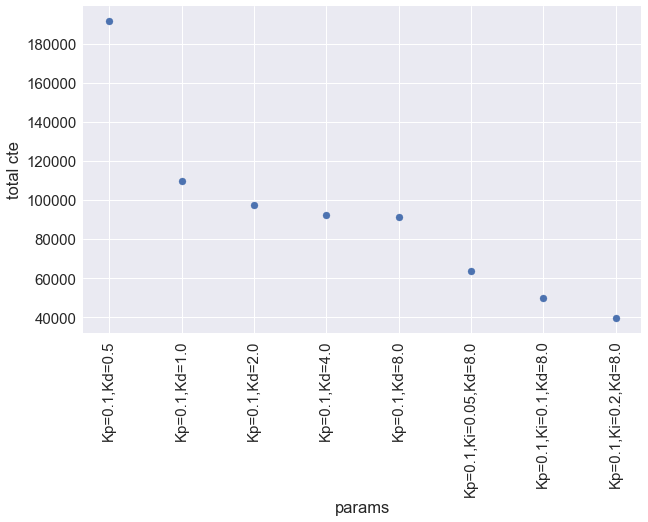

# PID Controller Project

This is a writeup for PID Controller Project.

## PID Control Update

The implementation of PID Control is given at line:62 in `main.cpp`.
The update at time step $t$ is calculated by the following way:

$$
  S_{t+1} = -K_p e^{\rm{cte}}_{t} - K_d (e^{\rm{cte}}_{t} - e^{\rm{cte}}_{t-1}) - K_i\frac{1}{n} \sum_{k=0}^{k=n-1}e^{\rm{cte}}_{t-k},
$$
where $S_{t+1}$ is steering value at the next step $t+1$, the $e^{cte}_{t}$ is CTE at time $t$, and $K_p, K_i, K_d$ are PID parameters. In this project, the summation at the $K_i$ term is performed over the last 100 step (i.e. $n=100$).

## Strategy of Prameter Tuning

I tackled this parameter tuning problem by the following way:

1. I started from the single parameter `Kp` and observed how the simulator behave.
2. Introduce the other parameters `Kd` and `Ki` in order to stabilize the simulator.
3. Parameter search is done in an exponential order (ex. 0.1, 0.2, 0.4, 0.8, 1.6, ...).

## Result

In order to evaluate the performance of simulation, I added logging function in my simulation program (line:68-69 in `main.cpp`). The log file includes `CTE`, `steering value`, `speed`, and so on.

First I set the parameter `Kp=0.1` and `Kp=1.0`. In this parameter simulator roughly oscillate and finally the car go out from the road. The `CTE` log is show in Figure 1, where x-axis is time step and y-axis is `CTE`.

Figure 1: Time evolution of `CTE` value with `Kp` term. The `CTE` oscillation gradually increased and the car went out from the road.

In order to stabilize the oscillation, according to the lecture, I introduce the `Kd` term. The simulation result was improved and the car managed to round the track. I examined the effects of different `Kd` parameters with fixed `Kp` (`=0.1`). The `CTE` log with different parameters are shown in Figure 2. From the plots, We can see that the oscillation of the `CTE` is reduced by increasing the `Kd` values.

Figure 2: Time evolution of `CTE` value with `Kp, Kd` terms. In these cases, the car succeeded to go around the track. We can see that the oscillation amplitudes are decreased as the `Kd` parameter increase.

Next, I introduced the `Ki` term by setting `Ki > 0`. This term is expected to reduce the long term bias effect. The result is shown in Figure 3. Initially the `Ki` term improved the result, but too large `Ki` value makes the car unstable. Finally, at `Ki=0.4` in the Figure 3, the car goes out from the road.

Figure 3: Time evolution of `CTE` value with `Kp, Kd, Ki` terms. Some moderate `Ki` value improve the result, but with larger `Ki` (`Ki=0.4`), the car roughly oscillate and went out from the road.

To evaluate the effects of different parameters, I defined an approximate total cte value in the following way:

$$
  E^{cte} = \sum_{t=0}^{t=n} \frac{(e^{cte}_{t} + e^{cte}_{t-1})}{2} v_{t} dt
$$

where $v_{t}$ is car speed at time $t$, $dt$ is time interval of the simulation time step. $E^{cte}$ rough estimation of the integrated `CTE` along the road the car passed.

Calculated $E^{cte}$ values with parameters examined above are shown in Figure 4. The summation is taken over 4250 steps, since the time steps it takes go around the entire track is approximately 4200 step in this simulation. According to the result of Figure 4, I selected the following parameters: `Kp = 0.1, Ki = 0.4, Kd = 8.0` as my candidate.

Figure 4: Approximate total cte value (smaller value is better) with different parameters.

### Scripts for the result

The script which create the figures are given in `./result/PIDControlAnalysis.ipynb`.
